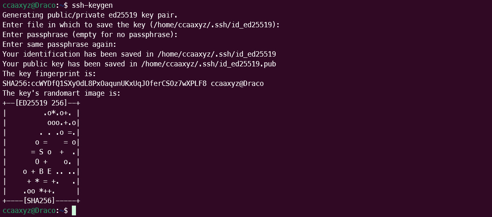
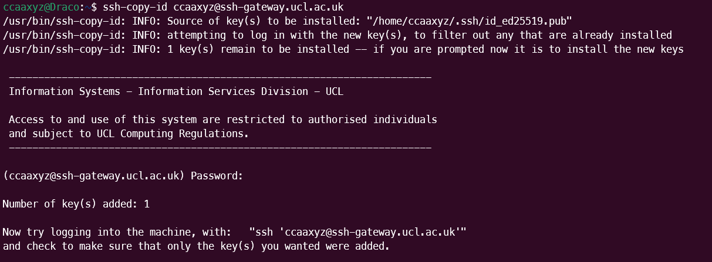
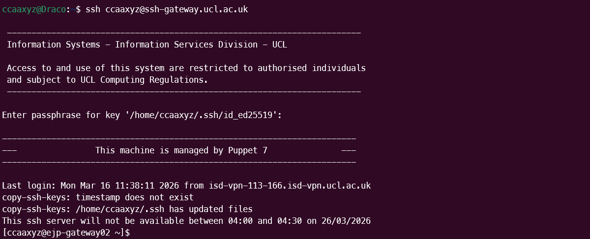
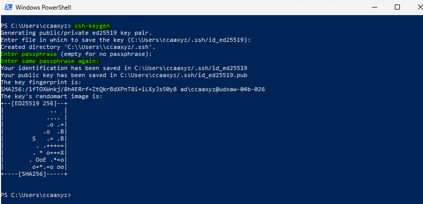
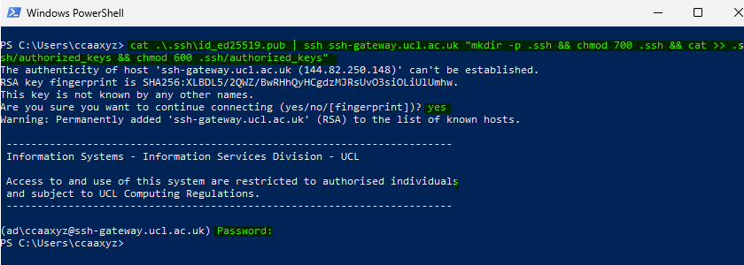
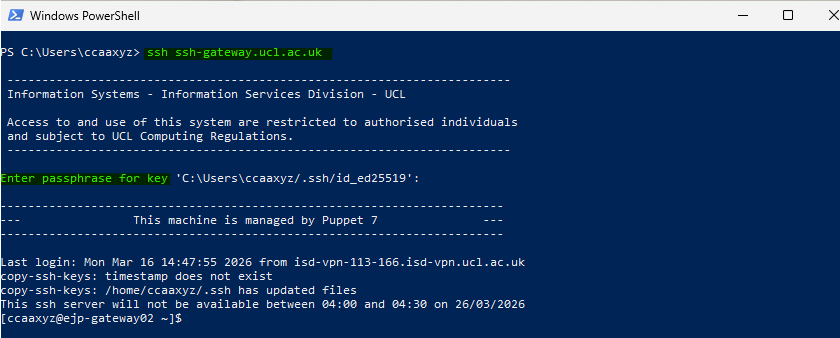
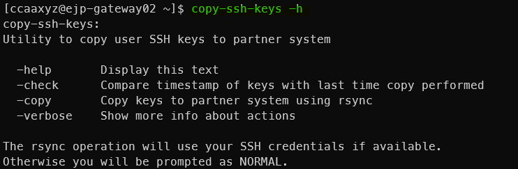
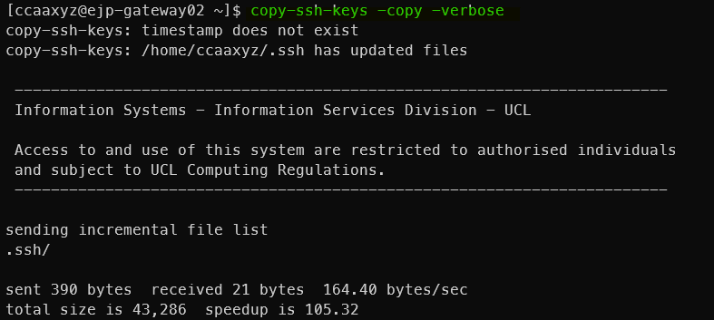

# Remote Access to Research Computing Resources

UCL's Research Computing services are accessible from inside the UCL firewall.  If you wish to connect from outside, you need to either connect through a VPN or use SSH to log in to a machine accessible from outside and use that to "jump" through into the UCL network.

As of 23 March 2026, you need to set up SSH keys on the SSH gateway to be able to log into it from outside UCL. It accepts password logins when you are on the [UCL VPN](https://www.ucl.ac.uk/isd/services/get-connected/ucl-virtual-private-network-vpn) or on [Desktop@UCL Anywhere](https://www.ucl.ac.uk/isd/services/computers/remote-access/desktopucl-anywhere) - you can use these routes to do the initial set up your SSH keys which you can then use from anywhere not at UCL.

- [SSH Gateway and Key Authentication documentation from ISD](https://liveuclac.sharepoint.com/sites/Cloud/SitePages/SSH-Gateway-+-Key-Authentication.aspx) - some of the below is copied from there.


## Set up SSH keys

The first time you use the SSH Gateway, you will need to be on the [UCL VPN](https://www.ucl.ac.uk/isd/services/get-connected/ucl-virtual-private-network-vpn) or on [Desktop@UCL Anywhere](https://www.ucl.ac.uk/isd/services/computers/remote-access/desktopucl-anywhere).

In order to enable SSH key authentication, you will first of all need to upload a private key to the service.

This can be done via the trusted sources (VPN/Desktop Anywhere).

### Create an SSH key pair on your own system

An SSH key consists of a public and private pair. The public key can be shared, while the private key should be kept safe, never emailed to anyone and never shared in any form.

Open a terminal and run `ssh-keygen`. It will ask you the location and name of the private key file to save, and show you the default place and name it will create. It will ask you for a passphrase - do not leave this blank, give it a memorable and secure passphrase. If you leave it blank, then your private key will be unencrypted. 

It will tell you that your identification has been saved (the private key) and that your public key has been saved (the same name with `.pub` on the end).

If you forget the passphrase, it is not recoverable and you will need to create a new key pair.



### Add the SSH public key to the gateway

The public key needs to be copied on to the systems you want to SSH into. You can do this with the Secure Copy command `scp` or you may have `ssh-copy-id` available as a command, which is more straightforward.

#### Example of adding a public key using `scp` while connected to the VPN:

You can do this in multiple commands, or you can run the one-line multi-part command given in [Using Desktop Anywhere instead of UCL VPN](#using-desktop-anywhere-instead-of-ucl-vpn). These are the multiple commands:

```
scp /home/ccaaxyz/.ssh/id_ed25519.pub ccaaxyz@ssh-gateway.ucl.ac.uk:
```

It will ask you for your UCL password and copy the file on to the ssh-gateway. The `:` at the end is important, it is followed by the remote location the key is being copied to - defaulting to your home directory. 

```
ssh ccaaxyz@ssh-gateway.ucl.ac.uk
mkdir -p .ssh
chmod go-rwx .ssh
cat id_ed25519.pub >> .ssh/authorized_keys
chmod go-rwx .ssh/authorized_keys
```

This logs you in to the gateway, makes a `.ssh` directory if it doesn't exist, sets the permissions so that no one other than you can read, write and execute. It appends the contents of your `.pub` file to the end of the `.ssh/authorized_keys` if it already exists, or creates it if it doesn't. It sets the permissions on that so that no one other than you can read and write.

#### Example of adding a public key using `ssh-copy-id` while connected to the VPN:

You can do this instead of the `scp` command above if you have a `ssh-copy-id` command available on your system.

```
ssh-copy-id ccaaxyz@ssh-gateway.ucl.ac.uk
```



### Test the key authentication by logging in

SSH into the gateway and observe whether it asks for your key passphrase instead of a password. (It may not, in either case go next to [Synchronise your key](synchronise-your-key).



### Using Desktop Anywhere instead of UCL VPN

You can still use ssh-keygen to generate a key, but you may prefer to generate the key somewhere else and just copy the contents of the public key file. The `ssh-copy-id` tool is not implemented on this platform, so a one line ssh command can be used instead.

Create a key pair in Windows PowerShell using `ssh-keygen`:


Upload the public key to the SSH Gateway with a one line multi-part command:

```
cat .\.ssh\id_ed25519.pub | ssh ccaaxyz@ssh-gateway.ucl.ac.uk "mkdir -p .ssh && chmod 700 .ssh && cat >> .ssh/authorized_keys && chmod 600 .ssh/authorized_keys"
```

This pipes in the contents of your `.pub` key file to an ssh command that connects to the gateway and then runs the bash commands in quotes. These are 
- `mkdir -p .ssh` - make a directory called `.ssh` if it doesn't exist
- `chmod 700 .ssh` - change the permissions on the `.ssh` directory to only read, write and executable by you
- `cat >> .ssh/authorized_keys` - append the piped-in contents of your `.pub` key file to `.ssh/authorized_keys`, creating it if it doesn't exist
- `chmod 600 .ssh/authorized_keys` - change the permissions on the `.ssh/authorized_keys` file to only readable and writable by you



Test the key authentication by logging in:



### Synchronise your key

The SSH gateway consists of two separate servers in a pool internally named `ejp-gateway01.ad.ucl.ac.uk` and `ejp-gateway02.ad.ucl.ac.uk`. You can see which machine you are logged into by the bash prompt.

Because the `/home` filesystem is not shared across the jump boxes, you need to sync SSH configuration files like `~/.ssh/authorized_keys` across all the available jump boxes so that the change takes effect whichever jump box you are allocated to.

If you have ended up on the server without your new keys, you can ssh directly to the other one with `ssh ejp-gateway01` if you are on `ejp-gateway02` or `ssh ejp-gateway02` if you are on `ejp-gateway01`.

A script is installed on the systems to help you with the synchronisation.

Check the help for the `copy-ssh-keys` command:
```
copy-ssh-keys -h
```



It can be run from one jump box and will use rsync to synchronise files in ~/.ssh to the other jump box:

```
copy-ssh-keys -copy -verbose
```



If `authorized_keys` does not match on the partner system then you will be prompted for your password.

!!! warning
    If you use SSH keys you absolutely **MUST NOT STORE UNENCRYPTED/NON-PASSWORD-PROTECTED PRIVATE KEYS ON THE CLUSTERS OR ANY OTHER MULTI-USER COMPUTER**. This is a security risk. We will be running regular scans of the filesystem to identify and then block unencrypted key pairs across our services.

Once the SSH gateway is set up you can then ssh on to the UCL RC service you are using as normal.

You can configure your ssh client to automatically connect via these jump boxes so that you make the connection in one step.

### Video resources

These videos show SSH key creation and use. They were created when you could still log in to the SSH Gateway with a password from outside UCL, however, so do not include a connecting to the VPN step. We show multiple steps for the `scp` option above rather than a one-line command.

We go on to add the SSH public key to the cluster in the same manner as you added it to the SSH Gateway.

* [SSH key pair pt 1 (moodle)](https://moodle.ucl.ac.uk/mod/page/view.php?id=4845640) (UCL users)
* [SSH key pair pt 2 (moodle)](https://moodle.ucl.ac.uk/mod/page/view.php?id=4845645) (UCL users)
* [SSH key pair pt 1 (mediacentral)](https://mediacentral.ucl.ac.uk/Play/96472) (non-UCL users)
* [SSH key pair pt 2 (mediacentral)](https://mediacentral.ucl.ac.uk/Play/96694) (non-UCL users)

### Single-step logins using tunnelling

#### Linux / Unix / macOS

##### On the command line
```
# Log in to Kathleen, jumping via jump box
# Replace ccxxxxx with your own username.
ssh -o ProxyJump=ccxxxxx@ssh-gateway.ucl.ac.uk ccxxxxx@kathleen.rc.ucl.ac.uk
```
or
```
# Copy 'my_file', from the machine you are logged in to, into your Scratch on Kathleen
# Replace ccxxxxx with your own username.
scp -o ProxyJump=ccxxxxx@ssh-gateway.ucl.ac.uk my_file ccxxxxx@kathleen.rc.ucl.ac.uk:~/Scratch/
```

This tunnels through the jump box service in order to get you to your destination - you'll be asked for your password twice, once for each machine. You can use this to log in or to copy files.

You may also need to do this if you are trying to reach one cluster from another and there is a firewall in the way.

##### Using a config file

You can create a config which does this without you needing to type it every time.

Inside your `~/.ssh` directory on your local machine, add the below to your `config` file (or create a file called `config` if you don't already have one).

Generically, it should be of this form where `<name>` can be anything you want to call this entry. You can use these as short-hand names when you run `ssh`.

```
Host <name>
   User <remote_user_id>
   HostName <remote_hostname>
   proxyCommand ssh -W <remote_hostname>:22 <remote_user_id>@ssh-gateway.ucl.ac.uk
```
This `proxyCommand` option causes the commands you type in your client to be forwarded on over a secure channel to the specified remote host.

On newer versions of OpenSSH, you can use `ProxyJump <remote_user_id>@ssh-gateway.ucl.ac.uk` 
instead of this `proxyCommand` line.

Here are some examples - you can have as many of these as you need in your config file.
```ssh-config
Host myriad
   User ccxxxxx
   HostName myriad.rc.ucl.ac.uk
   proxyCommand ssh -W myriad.rc.ucl.ac.uk:22 ccxxxxx@ssh-gateway.ucl.ac.uk

Host kathleen01
   User ccxxxxx
   HostName login01.kathleen.rc.ucl.ac.uk
   proxyCommand ssh -W login01.kathleen.rc.ucl.ac.uk:22 ccxxxxx@ssh-gateway.ucl.ac.uk

Host aristotle
   User ccxxxxx
   HostName aristotle.rc.ucl.ac.uk
   proxyCommand ssh -W aristotle.rc.ucl.ac.uk:22 ccxxxxx@ssh-gateway.ucl.ac.uk
```

You can now just type `ssh myriad` or `scp file1 aristotle:~` and you will go through the jump box. You'll be asked for login details twice since you're logging in to two machines, the jump box and your endpoint.  

#### Windows - WinSCP

WinSCP can also set up SSH tunnels.

 1. Create a new session as before, and tick the Advanced options box in the bottom left corner.
 2. Select Connection > Tunnel from the left pane.
 3. Tick the Connect through SSH tunnel box and enter the hostname of the gateway you are tunnelling through, for example ssh-gateway.ucl.ac.uk
 4. Fill in your username and password for that host. (Central UCL ones for the Gateway).
 5. Select Session from the left pane and fill in the hostname you want to end up on after the tunnel.
 6. Fill in your username and password for that host and set the file protocol to SCP.
 7. Save your settings with a useful name.

#### Creating a tunnel that other applications can use

Some applications do not read your SSH config file and also cannot set up tunnels themselves,
but can use one that you have created separately. FileZilla in particular is something you
may want to do this with to transfer your files directly to the clusters from outside UCL using 
a graphical client.

##### SSH tunnel creation using a terminal

You can do this in Linux, macOS and the Windows Command Prompt on Windows 10 and later.

Set up a tunnel between a port on your local computer (this is using 3333 as it is unlikely to be
in use, but you can pick different ones) to Myriad's port 22 (which is the standard port for ssh), 
going via a UCL gateway.


```
# replace ccxxxxx with your UCL username
ssh -L 3333:myriad.rc.ucl.ac.uk:22 ccxxxxx@ssh-gateway.ucl.ac.uk 
```

You may also want to use the `-N` option to tell it not to execute any remote commands and 
`-f` to put this command into the background if you want to continue to type other commands 
into the same terminal.

The tunnel now exists, and `localhost:3333` on your computer connects to Myriad.

You can do this with ports other than 22 if you are not wanting to ssh in but to instead connect
with a local browser to something running on Myriad. Here the port remains as 3333,
something could be launched on that port on Myriad and your browser could be pointed at 
`localhost:3333` to connect to it.

```
# replace ccxxxxx with your UCL username
ssh -L 3333:myriad.rc.ucl.ac.uk:3333 ccxxxxx@ssh-gateway.ucl.ac.uk
```

Do not leave things like this running for long periods on the login nodes.

##### SSH tunnel creation using PuTTY

On Windows you can also [set up a tunnel using PuTTY](https://winscp.net/eng/docs/guide_tunnel#tunnel_putty).

##### Connect to your tunnel with an application (like FileZilla)

You can then tell your application to connect to `localhost:3333` instead of Myriad. If it has 
separate boxes for hostname and port, put `localhost` as the hostname and `3333` as the port.

## File storage on the Gateway servers

The individual servers in the pool for the Gateway service have extremely limited file storage space, intentionally, and should not be used for storing files - if you need to transfer files you should use the two-step process above.  This storage should only be used for SSH configuration files.

This storage is not mirrored across the jump boxes which means if you write a file to your home directory, you will not be able to read it if you are allocated to another jump box next time you log in.
