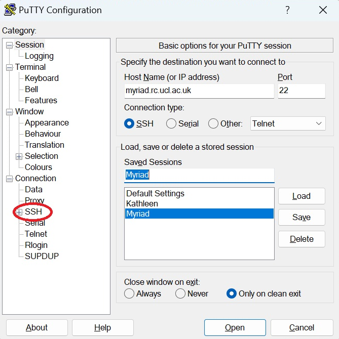
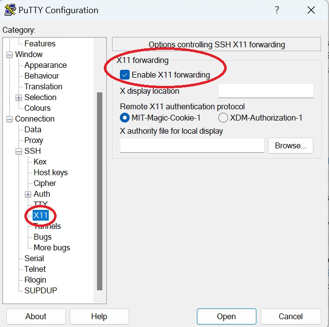

# Rclone

 [**Rclone**](https://rclone.org/) is a command-line program to manage files on cloud storage. This is a walkthrough for 
 configuring **Rclone** to be used with Microsoft OneDrive but it also can be used with several other cloud systems like 
 Dropbox, Google Drive, etc.

We have installed 2 versions of rclone in our clusters. ```rclone/1.61.0``` was used as reference for this walkthrough 
but the process is similar with other versions. Generally, you should use the highest-numbered version.

After loading the module with the command:

```
module load rclone/1.61.0
```

the next step is to configure **Rclone**. As the cloud systems usually have quite complicated authentication methods,
these are kept in a config file. For example, the configuration file for **OneDrive** and **Dropbox** involve getting 
a **token** from **Microsoft** and **Dropbox** respectively, to link your account in the cloud system with **Rclone**. 
There are several ways to get this token and here is presented the easiest. If this method does not work for you, please 
contact our support: [rc-support@ucl.ac.uk](mailto:rc-support@ucl.ac.uk)

The method that allows an automatic way to get and add the token to the configuration file requires using
[X-Forwarding](../Supplementary/X-Forwarding.md)
in your SSH connection. This will allow the cluster to push an interactive browser window to your local computer over a network. 
In this window you will enter your credentials and connect to the account you want to link with **Rclone** (e.g. Microsoft
One Drive or Dropbox). If you have activated MFA in your account, it will ask you for the respective code. Note that the 
connection to internet could not the best and it might take a while to load the page.

### X-Forwarding in Linux

If you are using Linux, the X-Forwarding is very easy. Just add `-X` option to your SSH command like this: 

```
ssh -X USER@CLUSTER.rc.ucl.ac.uk
```
### X-Forwarding in Mac

If you are using Mac, there is an app called **XQuartz** you must donwload first and then use the `-Y` option with the
`ssh` command to allow X-forwarding. Note that it might be necessary to restart your Mac after installing xQuartz to be 
able to use it for first time.

### X-Forwarding in Windows

If you are using Windows, you need to install an X server separately. The use of **Xming** with **Putty** is suggested 
to configure **Rclone**, although you can use your preferred method. You can download **Xming-fonts** free from 
[here](https://sourceforge.net/projects/xming/files/). Once you download it and install it, you must open **Xming** in your
computer before connecting to ssh. The application is always working on the background so you may not see anything opening after
clicking on it.

Then, to connect via SSH we suggest using **Putty** unless you know how to allow X-forwarding with another method. To
configure **Putty** to use X-Forwarding, you must look at the left side panel and go to ++"SSH"++ category. 

<figure id="est">
<div class="center">

</div>
</figure>

&nbsp;

Then select ++"X11"++ and ensure the checkbox for ++"Enable X11 forwarding"++ is checked/filled.  

<figure id="est">
<div class="center">

</div>
</figure>

&nbsp;

Then enter the details to connect to the cluster in the main window and that's all! If you are loading a previous 
saved session, then load the session first and then enable the X-Forwarding. 

After you have allowed X-Forwarding, you are ready to configure **Rclone**. 

## Rclone and OneDrive

After loading the **Rclone** module, run in the command line:

```
module load rclone/1.61.0
rclone config
```

The following menu and options will be displayed:

1.
```
No remotes found, make a new one?
n) New remote
s) Set configuration password
q) Quit config
n/s/q>
```
Select `n` and press the ++"Enter"++ key.

2.
```
Enter name for new remote.
name>
```
Enter a simple text label for your remote connection and press the ++"Enter"++ key. We've used `UCLDrive` here, and it is easier to correctly use on the command-line if it does not contain spaces.

3. Something similar to this will be displayed. Please check what number corresponds to **Microsoft OneDrive**
   option and enter that one. 
```
Option Storage.Type of storage to configure.
Choose a number from below, or type in your own value.
1 / 1Fichier   \ (fichier)
2 / Akamai NetStorage   \ (netstorage)
3 / Alias for an existing remote   \ (alias)
4 / Amazon S3 Compliant Storage Providers including AWS, Alibaba, ArvanCloud, Ceph, ChinaMobile, Cloudflare, DigitalOcean,
    Dreamhost, GCS, HuaweiOBS, IBMCOS, IDrive, IONOS, LyveCloud, Leviia, Liara, Linode, Magalu, Minio, Netease, Outscale,
    Petabox, RackCorp, Rclone, Scaleway, SeaweedFS, Selectel, StackPath, Storj, Synology, TencentCOS, Wasabi, Qiniu and others   \ (s3)
5 / Backblaze B2   \ (b2)
6 / Better checksums for other remotes   \ (hasher)
7 / Box   \ (box)
8 / Cache a remote   \ (cache)
9 / Citrix Sharefile   \ (sharefile)
10 / Cloudinary   \ (cloudinary)
11 / Combine several remotes into one   \ (combine
12 / Compress a remote   \ (compress)
13 / Dropbox   \ (dropbox)
14 / Encrypt/Decrypt a remote   \ (crypt)
15 / Enterprise File Fabric   \ (filefabric)
16 / FTP   \ (ftp
17 / Files.com   \ (filescom)
18 / Gofile   \ (gofile)
19 / Google Cloud Storage (this is not Google Drive)   \ (google cloud storage
20 / Google Drive   \ (drive)
21 / Google Photos   \ (google photos)
22 / HTTP   \ (http)
23 / Hadoop distributed file system   \ (hdfs)
24 / HiDrive   \ (hidrive)
25 / ImageKit.io   \ (imagekit)
26 / In memory object storage system.   \ (memory)
27 / Internet Archive   \ (internetarchive)
28 / Jottacloud   \ (jottacloud)
29 / Koofr, Digi Storage and other Koofr-compatible storage providers   \ (koofr)
30 / Linkbox   \ (linkbox)
31 / Local Disk   \ (local)
32 / Mail.ru Cloud   \ (mailru)
33 / Mega   \ (mega)
34 / Microsoft Azure Blob Storage   \ (azureblob)
35 / Microsoft Azure Files   \ (azurefiles)
36 / Microsoft OneDrive   \ (onedrive)
37 / OpenDrive   \ (opendrive)
38 / OpenStack Swift (Rackspace Cloud Files, Blomp Cloud Storage, Memset Memstore, OVH)   \ (swift)
39 / Oracle Cloud Infrastructure Object Storage   \ (oracleobjectstorage)
40 / Pcloud   \ (pcloud)
41 / PikPak   \ (pikpak)
42 / Pixeldrain Filesystem   \ (pixeldrain)
43 / Proton Drive   \ (protondrive)
44 / Put.io   \ (putio)
45 / QingCloud Object Storage   \ (qingstor)
46 / Quatrix by Maytech   \ (quatrix)
47 / SMB / CIFS   \ (smb)
48 / SSH/SFTP   \ (sftp)
49 / Sia Decentralized Cloud   \ (sia)
50 / Storj Decentralized Cloud Storage   \ (storj
51 / Sugarsync   \ (sugarsync)
52 / Transparently chunk/split large files   \ (chunker
53 / Uloz.to   \ (ulozto)
54 / Union merges the contents of several upstream fs   \ (union)
55 / Uptobox   \ (uptobox)
56 / WebDAV   \ (webdav)
57 / Yandex Disk   \ (yandex
58 / Zoho   \ (zoho)
59 / iCloud Drive   \ (iclouddrive)
60 / premiumize.me   \ (premiumizeme)
61 / seafile   \ (seafile)
Storage> 
```
In this case,**Microsoft OneDrive** corresponds to option 36, so enter `36` and press the ++"Enter"++ key.

4.
```
Option client_id. OAuth Client Id.
Leave blank normally.
Enter a value. Press Enter to leave empty.
client_id> 
```
Press ++"Enter"++ to leave empty.

5.
```
Option client_secret. OAuth Client Secret.
Leave blank normally.
Enter a value. Press Enter to leave empty.
client_secret> 
```
Press ++"Enter"++ to leave empty.

6.
```
Option region. Choose national cloud region for OneDrive.
Choose a number from below, or type in your own value of
type string.
Press Enter for the default (global).
1 / Microsoft Cloud Global   \ (global)
2 / Microsoft Cloud for US Government   \ (us)
3 / Microsoft Cloud Germany (deprecated - try global region first).   \ (de)
4 / Azure and Office 365 operated by Vnet Group in China   \ (cn)
region>
```
Select `1` and press the ++"Enter"++ Key.

```
Option tenant.ID of the service principal's tenant. Also called its directory ID.
Set this if using- Client Credential flowEnter a value.
Press Enter to leave empty.
tenant> 
```
Press ++"Enter"++ to leave empty.

8.
```
Edit advanced config?
y) Yes
n) No (default)
y/n>
```
Select `n` and press the ++"Enter"++ key.

9.
```
Use web browser to automatically authenticate rclone with remote?
* Say Y if the machine running rclone has a web browser you can use
* Say N if running rclone on a (remote) machine without web browser access
If not sure try Y. If Y failed, try N.
y) Yes (default)
n) No
y/n>
```
Select `y` and press the ++"Enter"++ key.

**If you have installed Xming and habilitated correctly X-Forwarding in Putty or your preferred method, 
then a browser window will open on your personal machine. There, you must log in, in this case into Microsoft 365 using 
your UCL account (internal).**

10.
```
Option config_type.Type of connectionChoose a number from below,
or type in an existing string value.
Press Enter for the default (onedrive).
1 / OneDrive Personal or Business   \ (onedrive)
2 / Root Sharepoint site   \ (sharepoint)   / Sharepoint site name or URL
3 | E.g. mysite or https://contoso.sharepoint.com/sites/mysite   \ (url)
4 / Search for a Sharepoint site   \ (search)
5 / Type in driveID (advanced)   \ (driveid)
6 / Type in SiteID (advanced)   \ (siteid)   / Sharepoint server-relative path (advanced)
7 | E.g. /teams/hr   \ (path
config_type> 
```
Select `1` and press the ++"Enter"++ key.

11.
```
Option config_driveid. Select drive you want to use
Choose a number from below, or type in your own string value.
Press Enter for the default (b!ra4Fi4CqS0GYT_qied18V9A2pTgX9JxHhfZTS2MwNK-0r_cRHFddS7D8Yt0CozO-).
1 / OneDrive (business)   \ (b!ra4Fi4CqS0GYT_qied18V9A2pTgX9JxHhfZTS2MwNK-0r_cRHFddS7D8Yt0CozO-)
2 / PersonalCacheLibrary (business)   \ (b!ra4Fi4CqS0GYT_qied1OP9A2pTgX9JxHhfZTS2MwNK9-7X_uAf71Qavjc1vd7Xis)
config_driveid> 
```
Select `1` and press the ++"Enter"++ key.

12.
```
Drive OK Found drive "root" of type "business"
URL: https://liveuclac-my.sharepoint.com/personal/<YOUR_UCL_ID>_ucl_ac_uk/Documents
y) Yes (default)
n) No
y/n>
```
If the URL is ok, then select `y` and press the ++"Enter"++ key.

13.
```
Configuration complete.
```

Then it will show you the remote you just added:

14.
```
Options:
- type: onedrive
- region: global
- token:{"access_token":"eyJ0eXAiOiJKV1QiLCJub25jZSI6IkxmaXR6d2hKWkVaOGstRlZqZEh
iOHFCUHZGMnFZSE8tQmpORV80d1lQWTQiLCJhbGciOiJSUzI1NiIsIng1dCI6IkNOdjBPSTNSd3FsSEZ
FVm5hb01Bc2hDSDJYRSIsImtpZCI6IkNOdjBPSTNSd3FsSEZFVm5hb01Bc2hDSDJYRSJ9.eyJhdWQiOs
iIwMDAwMDAwMy0wMDAwLTAwMDAtYzAwMC0wMDAwMDAwMDAwMDAiLCJpc3MiOiJodHRwczovL3N0cy53a
mwxQHVjbC5hYy51ayIsInVwbiI6InNrZ3RubDFAdWNsLmFjLnVrIiwidXRpIjoiWE9OQ3hPYW5sazJXV
0tRVnVONHJBQSIsInZlciI6IjEuMCIsIndpZHMiOlsiYjc5ZmJmNGQtM2VmOS00Njg5LTgxNDMtNzZiM
Tk0ZTg1NTA5Il0sInhtc19mdGQiOiJOal9Zd1hsRG9pY0tyWnpUaS1wQWZPYjloR1RReEVFbW5ybXRHU
kt6ekI0IiwieG1zX2lkcmVsIjoiMSAzMCIsInhtc19zdCI6eyJzdWIiOiJJOTdqOF9WWXljNnNhVkxWQ
1UtN3hIcEI3TVdzYWJ4cW9oNnZnbWttMl9nIn0sInhtc190Y2R0IjoxMzYwODcxMzQ1fQ.F-Ma2iOnL"} 
- drive_id: b!ra4Fi4CqS0GYT_qied1OV9A2pTgX9JxHhfZTS2MwNK-0r_cRHFddS7D8Yt0CozO-
- drive_type: business
Keep this "UCLDrive" remote?
y) Yes this is OK (default)
e) Edit this remote
d) Delete this remote
y/e/d> 
```
If everything is ok., then select `y` and press the ++"Enter"++ key.

Now you are ready to use **Rclone**!

If you are new using **Rclone**, please look at the [official basic syntax documentation](https://rclone.org/docs/#basic-syntax).
